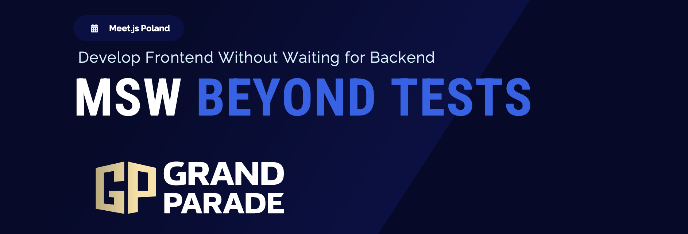

# MeetJS - MSW Beyond Tests Demo

A production-style demo project for the talk **"MSW Beyond Tests: Develop Frontend Without Waiting for Backend"**.

This repo shows how to build frontend features without blocking on backend readiness, while still preserving a real integration path.

<p align="center">
  
</p>

👨‍🏫 Davit Hunanyan – **MSW Beyond Tests: Develop Frontend Without Waiting for Backend**
Frontend teams are often blocked by unstable environments, missing endpoints, or shifting API contracts. In this talk, Dhunanyan shares a practical case study of building a real-world Next.js dashboard with runtime switching between **MSW Intercept** and **Bypass to Real API**. You’ll see how to keep shipping UI when backend is unavailable, simulate realistic failure scenarios on demand, and still preserve an honest integration path. Expect a live demo, architecture patterns you can adopt quickly, and concrete guidance for making frontend delivery faster, safer, and more predictable.

## Quick Links

<p align="center">
  <a href="https://mswjs.io/"></a>
  <a href="https://nextjs.org/"></a>
</p>

<p align="center">
  <a href="https://nextjs.org/docs"></a>
  <a href="https://react.dev/"></a>
  <a href="https://www.typescriptlang.org/docs/"></a>
  <a href="https://mswjs.io/docs"></a>
  <a href="https://nodejs.org/docs/latest-v20.x/api/"></a>
  <a href="https://classic.yarnpkg.com/en/docs/"></a>
  <a href="LICENSE"></a>
</p>

<p align="center">
  <a href="https://github.com/dhunanyan/meetjs/raw/refs/heads/master/presentation/gp_msw_beyond_tests.pptx">
  
  </a>
</p>

## Why This Repo Exists

- Unblock frontend development when backend is down or not ready.
- Switch between mocked and real networking at runtime.
- Keep Local API and Backend API aligned with one shared real data source.
- Make runtime state visible with clear warning UX.

## Core Capabilities

- Runtime switch: `MSW Intercept` vs `Bypass to Real API`
- Runtime target: `Local API (/api)` vs `Backend Endpoint`
- Scenario-driven behavior simulation (in MSW mode)
- Manual refresh flow for explicit transitions
- Shared real dataset for Local API + Node backend: `db/dashboard.json`

## Architecture

```text
Browser UI (Next.js App Router)
  -> Data Source switch:
      1) MSW Intercept
      2) Bypass to Real API

Real API target switch:
  A) Local API routes (/api/*)
  B) Node API server (localhost:8787)

Real data source for A + B:
  db/dashboard.json
```

## Tech Stack

- Next.js App Router
- React 19
- TypeScript
- MSW (browser worker)
- Node.js HTTP server (`tsx`)

## Project Structure

- `app/` - Next.js app and local API routes
- `components/` - dashboard and UI components
- `context/` - MSW provider/context
- `mocks/` - MSW worker + handlers
- `server/` - standalone Node API + swagger page
- `db/dashboard.json` - shared real data seed
- `utils/dashboard-db.ts` - DB clone + summary recompute helpers
- `presentation/` - talk deck and speaker materials

## Quick Start

```bash
yarn
```

Run client + Node API together:

```bash
yarn dev
```

## Run Modes

Run only Next.js client ([http://localhost:3000](http://localhost:3000)):

```bash
yarn dev:client
```

Run only Node API server ([http://localhost:8787/swagger](http://localhost:8787/swagger)):

```bash
yarn dev:server
```

Force-disable MSW in client:

```bash
yarn dev:client:no-mock
```

Production build (client):

```bash
yarn build
yarn start
```

## API & Ops Endpoints (Node Server)

- `GET /healthz`
- `GET /readyz`
- `GET /version`
- `GET /openapi.json`
- `GET /swagger` (controlled by `SERVER_SWAGGER_ENABLED`)

## Environment Variables

Copy `env.example` and set as needed:

- `NEXT_PUBLIC_API_BASE_URL` - backend base URL for client
- `NEXT_PUBLIC_API_MOCKING` - `enabled` or `disabled`
- `NEXT_PUBLIC_APP_URL` - canonical app URL for metadata
- `NEXT_PUBLIC_ALLOW_INDEXING` - `false` recommended for nonprod
- `NEXT_PUBLIC_APP_ENV` - `development`, `nonprod`, etc.
- `APP_NAME`
- `APP_ENV`
- `APP_VERSION`
- `SERVER_HOST`
- `SERVER_PORT`
- `SERVER_CORS_ORIGIN`
- `SERVER_SWAGGER_ENABLED`

## Demo Workflow (Recommended)

1. Start with **Backend Endpoint + Bypass to Real API**
2. Stop backend server and show backend-unreachable warning
3. Switch to **MSW Intercept** and continue working
4. Show scenarios (`server-500`, `network-error`, `partial-data`, etc.)
5. Return to Bypass mode to validate real path

## Presentation Assets

- Main deck: [gp_msw_beyond_tests.pptx](https://github.com/dhunanyan/meetjs/raw/refs/heads/master/presentation/gp_msw_beyond_tests.pptx)
- Slides source: `presentation/slides.md`
- Speaker script: `presentation/speach.md`

## Contributing

Please read:

- `.github/CONTRIBUTING.md`
- `.github/CODE_OF_CONDUCT.md`
- `.github/SECURITY.md`

## License

MIT - see [LICENSE](LICENSE).
